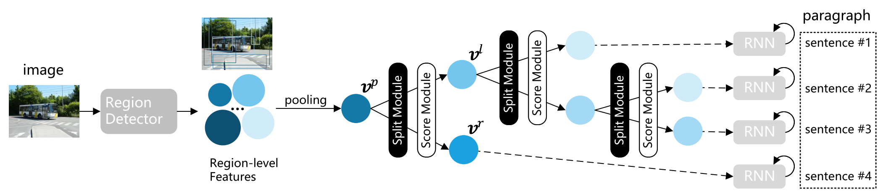

# S2TD
code for "S2TD: A Tree-Structured Decoder for Image Paragraph Captioning" accepted by MMAsia 2021

## Overview

## Notes

1. The code is based on [soloist97/region-hierarchical-pytorch](https://github.com/soloist97/region-hierarchical-pytorch). For convenient, we recommend you to read its [README.md](https://github.com/soloist97/region-hierarchical-pytorch/blob/main/README.md) first and follow the instructions to setup the environment.
* The code uses the same image features & preprocessed paragraph input files. 
* The code shares almost the same training & evaluating commends. (If you want to generate sentence trees during evaluating, please add `--tree`.)
* Extra package requirements:
    - [caesar0301/treelib](https://github.com/caesar0301/treelib)

2. For pre-parsed tree structure of paragraphs
